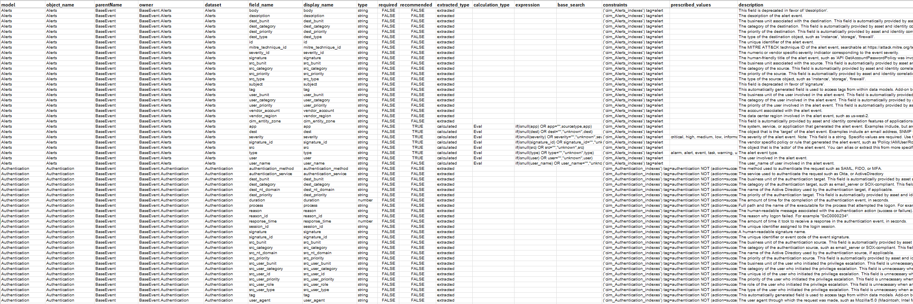
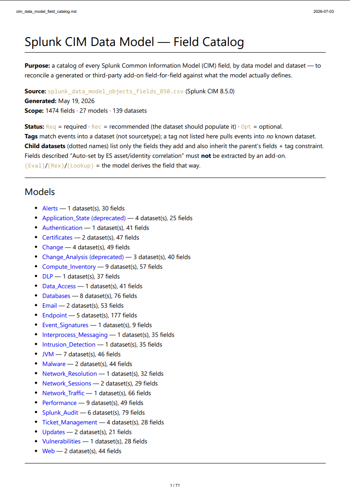
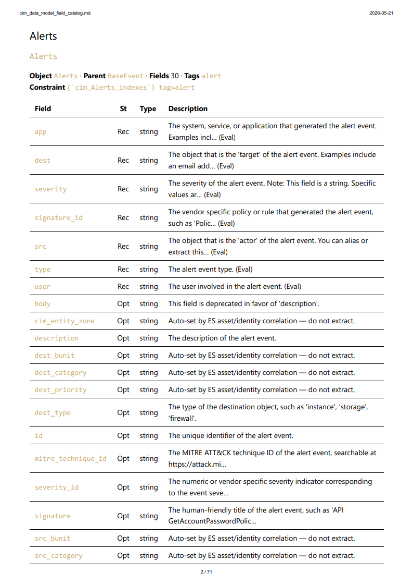
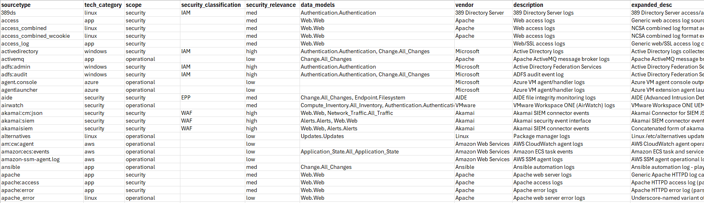
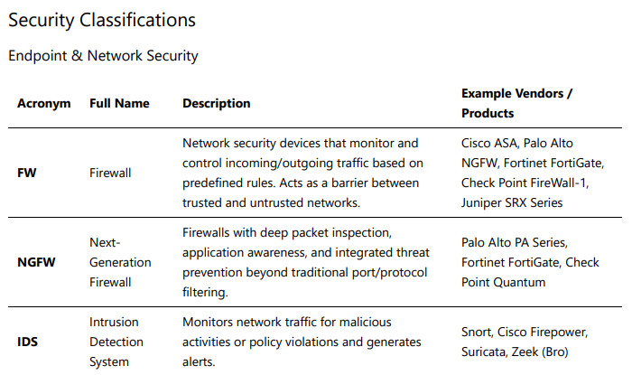
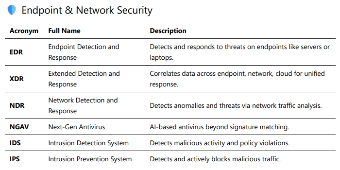
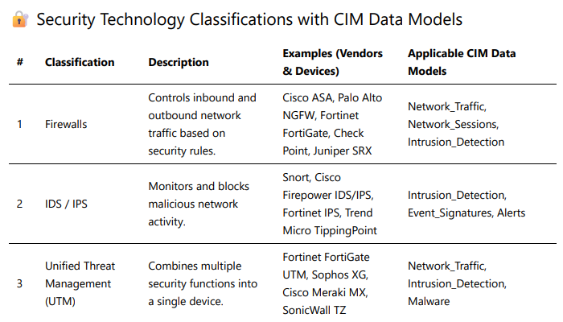

# README for splunk-cim-reference

A community-maintained reference for Splunk® CIM (Common Information Model) work. The headline artifact is a flat CSV of every CIM data model, dataset, field, type, prescribed value, constraint, and description — generated directly from Splunk's CIM app JSON. The repo also includes sourcetype classification tooling, a security device taxonomy, and the parsing script used to (re)generate the CSV.

> **📥 To download any file:** click the filename link below to open the GitHub file view, then click the **Download raw file** button (⬇ icon in the top-right of the file toolbar). Clicking the link alone opens an in-browser preview — the download button saves the file locally.

## Contents  

[CIM Data Model Field Reference](#cim-data-model-field-reference--start-here)  
[Data Model Field Reference](#data-model-field-reference)  
[CIM Sourcetype Inventory](#cim-sourcetype-inventory)  
[Sourcetype Inventory Version Sidecar](#sourcetype-inventory-version-sidecar)  
[Security Classification Taxonomy](#security-classification-taxonomy)  
[CIM Data Model Parsing Tools](#cim-data-model-parsing-tools)  
[Updating the CIM Field Reference](#updating-the-cim-field-reference)  
[Related Projects](#related-projects)  
[Contributing](#contributing)  
[License](#license)  

---

## CIM Data Model Field Reference — start here

The core of this repo is a single flat CSV per CIM release that lists every field across every data model and dataset, with types, required/recommended flags, prescribed values, constraints, descriptions, base searches, and calculated-field expressions. Fields not marked as required or recommended are considered 'optional' fields. This data is the source of truth used by everything else in this repo (the `data_models` column of the [CIM Sourcetype Inventory](#cim-sourcetype-inventory), for example) as well as the [CIM Assessment Toolkit (CAT)](https://splunkbase.splunk.com/app/8962).  



| File | CIM version | Status |
|------|-------------|--------|
| [`splunk_data_model_objects_fields_850.csv`](https://github.com/machinedatainsights/splunk-cim-reference/blob/main/splunk_data_model_objects_fields_850.csv) | 8.5.0 | **Preferred — use this for new work** |
| [`splunk_data_model_objects_fields_640.csv`](https://github.com/machinedatainsights/splunk-cim-reference/blob/main/splunk_data_model_objects_fields_640.csv) | 6.4.0 | Retained for environments pinned to CIM 6.x |

Both files share the same column schema, so any consumer (search, transform, AI prompt, dashboard) can target either. Default to `_850.csv` unless you specifically need to match an environment that is pinned to CIM 6.x — in which case use `_640.csv` to avoid flagging fields that don't yet exist in that release.  

Both files are derived from the `<datamodel>.json` files included in the [Splunk Common Information Model (CIM)](https://splunkbase.splunk.com/app/1621) app and generated by `parse_cim_datamodels.py` (see [Updating the CIM Field Reference](#updating-the-cim-field-reference) below).  

These reference files can be regenerated for any future CIM version using the same script.

### Column Reference: splunk_data_model_objects_fields_850.csv

One row per field per dataset, extracted from the Splunk CIM 8.5.0 data model
JSON definitions. 1,474 rows covering 27 data models.

Notes on the data:

- `display_name` never differs from `field_name` in the 8.5.0 release; it is
  retained for completeness.
- `owner` is the reliable deduplication key, since dataset names like `Ports`
  and `Processes` repeat across models (e.g. Endpoint and Application_State).
- The inventory includes the `Splunk_Audit` and `Splunk_CIM_Validation`
  models, which are internal/validation models not typically targeted by
  add-on normalization work.

| Column | Description | Relevance |
|---|---|---|
| `model` | The CIM data model the field belongs to (e.g. `Authentication`, `Endpoint`, `Network_Traffic`). 27 models in this release. | Primary grouping key. Filter on this first when scoping normalization work for a sourcetype. |
| `object_name` | The dataset (object) name within the model as defined in the data model JSON (e.g. `Processes`, `Account_Management`). | Identifies which node in the model hierarchy defines or inherits the field. |
| `parentName` | The immediate parent dataset in the model's inheritance tree (e.g. `BaseEvent`, `All_Changes`). Fields cascade from parent to child datasets. | Explains where a field originates. Fields on a parent like `All_Changes` apply to every child dataset beneath it. |
| `owner` | Fully qualified `parent.object` path (e.g. `All_Changes.Account_Management`). | Unambiguous dataset identifier; useful for joins and dedup since object names repeat across models (e.g. `Ports` exists in both Endpoint and Application_State). |
| `dataset` | The dotted dataset path as used in `tstats` and `datamodel` searches (e.g. `All_Changes.Account_Management`). Equals `object_name` for root datasets. | The exact string you reference in `tstats from datamodel=Model.Dataset` searches and in CAT/CAS output targeting. |
| `field_name` | The CIM field name as it must appear in normalized events (e.g. `src`, `action`, `process_name`). | The target of your props.conf aliases, EVALs, and extractions. This is the contract your TA must fulfill. |
| `display_name` | The UI display label for the field. Identical to `field_name` in this release for all rows. | Retained for completeness and future-proofing; safe to ignore for normalization work. |
| `type` | The field's declared data type: `string`, `number`, `boolean`, or `timestamp`. | Type mismatches (e.g. a string `bytes` field) break tstats aggregations and acceleration; validate outputs against this. |
| `required` | Boolean. Whether the field is mandatory for the dataset per the CIM spec. | Required fields are the minimum bar for a compliant TA; missing ones cause events to drop out of constraint searches or produce unusable rows. |
| `recommended` | Boolean. Whether Splunk flags the field as recommended (heavily used by ES/ITSI content) without being strictly required. | The practical priority tier after required fields; most correlation searches assume these exist. |
| `extracted_type` | Either `extracted` (expected to come from the source/TA) or `calculated` (derived within the data model itself). | Tells you whose job the field is. `calculated` fields are produced by the model's own EVAL/Rex/Lookup logic; do not duplicate them in your TA. |
| `calculation_type` | For calculated fields only: `Eval`, `Rex`, or `Lookup`. Empty for extracted fields (286 of 1,474 rows populated). | Identifies the mechanism behind model-side derivations, useful when debugging why a field's value differs from your raw data. |
| `expression` | The actual EVAL expression, regex, or lookup definition behind a calculated field (e.g. `if(isnull(dest) OR dest="","unknown",dest)`). | Shows exactly how the model coerces or defaults values. Explains the common "unknown" placeholder behavior seen in data model results. |
| `base_search` | The dataset-level base search, populated only for search-based (non-event) datasets such as `Endpoint.Ports` (320 rows). | Flags datasets built from a search pipeline rather than tag constraints alone; these behave differently under acceleration and cannot be fed by tags alone. |
| `constraints` | The dataset's constraint search, including the index macro and tag requirements (e.g. ``(`cim_Authentication_indexes`) tag=authentication``). | The gatekeeper. Your eventtypes/tags must satisfy this exactly for events to enter the dataset. Also documents which tags each dataset expects. |
| `prescribed_values` | The allowed value list for fields with a controlled vocabulary (e.g. `action`: `success, failure, pending, error`). Populated for 61 rows. | Critical for compliance: values outside this list silently break dashboards and correlation logic that filter on exact values. A core CAT v2 validation target. |
| `description` | The official Splunk description of the field, including deprecation notices and warnings (e.g. fields auto-populated by ES asset/identity correlation that TAs must not extract). | The authoritative reference for field semantics; read before mapping ambiguous source fields, and heed the "do not define extractions" warnings. |

[Top](#contents)  

---

## Data Model Field Reference

For reading and field-by-field reconciliation (rather than machine consumption), a rendered catalog of the preferred 8.5.0 reference is also included:

     

| File | Description |
|------|-------------|
| [`cim_data_model_field_catalog.md`](https://github.com/machinedatainsights/splunk-cim-reference/blob/main/cim_data_model_field_catalog.md) | Human-readable Markdown catalog of every CIM 8.5.0 field, organized by model → dataset, with status (`Req`/`Rec`/`Opt`), type, tags, constraints, prescribed values, and descriptions. Derived directly from `splunk_data_model_objects_fields_850.csv` (1,474 fields · 27 models · 139 datasets). Use this to reconcile a generated or third-party add-on field-for-field against what the model actually defines. Note that the `Splunk Audit Logs` section has been removed. |
| [`cim_data_model_field_catalog.pdf`](https://github.com/machinedatainsights/splunk-cim-reference/blob/main/cim_data_model_field_catalog.pdf) | PDF rendering of the same catalog. |

[Top](#contents)  

---

## CIM Sourcetype Inventory

A list of ~850 (and growing) common Splunk sourcetypes and metadata for each sourcetype.  

**If you wish to contribute to or correct/supplement entries in this inventory please see [Contributing](#contributing) below.**  



| File | Description |
|------|-------------|
| [`cim_sourcetype_inventory.csv`](https://github.com/machinedatainsights/splunk-cim-reference/blob/main/cim_sourcetype_inventory.csv) | Master reference of common Splunk sourcetypes classified by vendor, security relevance, scope, applicable CIM data models, and exclusion status. Starting point for CIM normalization projects. |
| `cim_sourcetype_inventory.xlsx` | Excel version with ease of viewing / filtering options set |
| [`cim_sourcetype_inventory.csv.version.csv`](https://github.com/machinedatainsights/splunk-cim-reference/blob/main/cim_sourcetype_inventory.csv.version.csv) | Sidecar version/provenance file for the inventory. Single-row CSV (`last_updated`, `updated_by`, `note`, `base_catalog_last_updated`) that the CIM Assessment Toolkit reads to report which inventory is loaded and to distinguish the bundled reference inventory from a custom, environment-specific one. See [Sourcetype Inventory Version Sidecar](#sourcetype-inventory-version-sidecar). |

### Sourcetype Inventory Format

`cim_sourcetype_inventory.csv` uses the following columns:

| Column | Description |
|--------|-------------|
| `sourcetype` | Splunk sourcetype name |
| `tech_category` | Canonical technology family the sourcetype's data belongs to — one of `app`, `aws`, `azure`, `gcp`, `linux`, `network`, `security`, `windows`. Single value per sourcetype. Identifies the index *technology type* a sourcetype lands in (e.g., index suffixes such as `*_linux` / `*_aws` / `*_security`), so organizations can administer CIM data-model macros by technology type rather than enumerating every index, and data landing in new indexes of that technology type is picked up automatically. |
| `scope` | `security`, `operational`, `security, operational`, `none`, or `unknown` |
| `security_classification` | Acronym(s) from `security_classifications_reference.md` (e.g., `EDR`, `NGFW`). `N/A` for non-security sourcetypes. |
| `security_relevance` | `high`, `med`, `low`, or `none` |
| `data_models` | Applicable CIM data models in `Model.Dataset` format (e.g., `Authentication.Authentication`). Up to 3, drawn from the CIM field reference CSV (preferably `splunk_data_model_objects_fields_850.csv`; `_640.csv` for CIM 6.x environments). |
| `vendor` | Technology vendor |
| `description` | Brief description (50 characters max) |
| `expanded_desc` | Long-form description (1-3 sentences) covering vendor product context, payload, and CIM mapping where applicable |

**Note regarding Windows `WinEventLog` / `XmlWinEventLog` sourcetypes:**  

These are the only entries where the text after the colon is **not part of the sourcetype**. In Splunk, `WinEventLog` (classic) and `XmlWinEventLog` (XML) are each a *single* sourcetype that multiplexes many distinct Windows event channels; the specific channel is carried in the **`source`** field, not the sourcetype. Inventory rows such as `WinEventLog:Security`, `XmlWinEventLog:Security`, or `XmlWinEventLog:Microsoft-Windows-Sysmon/Operational` therefore denote a **`sourcetype` + `source`** pair — e.g. `sourcetype=XmlWinEventLog source="XmlWinEventLog:Security"` — and are listed individually because each channel maps to different CIM data models. To target one in a search or CIM data-model macro, combine the sourcetype with the source; matching the sourcetype alone (`sourcetype=XmlWinEventLog`) returns *every* channel. The plain `WinEventLog` and `XmlWinEventLog` rows represent the sourcetype as a whole.

[Top](#contents)  

---

## Sourcetype Inventory Version Sidecar

`cim_sourcetype_inventory.csv` ships with a sidecar file that records the inventory's provenance: `cim_sourcetype_inventory.csv.version.csv`. The CIM Assessment Toolkit (CAT) reads this sidecar to report which inventory is loaded and to distinguish the bundled reference inventory from a custom, environment-specific one.

**Naming convention:** the sidecar is the inventory filename with `.version.csv` appended (`cim_sourcetype_inventory.csv` → `cim_sourcetype_inventory.csv.version.csv`). Keep the two files together.

**Format:** a single data row under a header, with these columns:

| Column | Description |
|--------|-------------|
| `last_updated` | Date this inventory (bundled or customized) was last updated (`YYYY-MM-DD`) |
| `updated_by` | Email or identity of whoever produced this inventory |
| `note` | Free-text note — e.g., that this is the bundled reference inventory, or a custom inventory for a specific environment |
| `base_catalog_last_updated` | The `last_updated` date of the standard bundled catalog this inventory is built on (`YYYY-MM-DD`). For the bundled reference inventory this equals `last_updated`. For a customized inventory it stays pinned to the base catalog release the customizations were layered on top of, so operators can tell which upstream catalog version a custom inventory derives from — and detect when a newer base catalog is available to re-merge against. |

```csv
last_updated,updated_by,note,base_catalog_last_updated
"2026-05-17","jim.baxter@machinedatainsights.com","Initial addition of the cim_sourcetype_inventory.csv.version.csv file","2026-05-17"
```

When delivering a customized `cim_sourcetype_inventory.csv` to the CIM Assessment Toolkit (CAT) — for example, one extended with sourcetypes that are unique to a particular environment (custom apps and the like) or not yet in the standard catalog — supply a matching sidecar whose `note` flags it as a custom inventory and whose `last_updated` / `updated_by` reflect that change. Leave `base_catalog_last_updated` set to the `last_updated` value of the standard catalog the customizations were built on; don't advance it when you edit the custom inventory. This decouples "when was this (custom) inventory last touched" from "which release of the standard catalog it descends from," so when the bundled catalog is updated an operator can compare the two dates and decide whether to re-merge their customizations onto the newer base. CAT surfaces these values so operators can tell at a glance which inventory is in effect and how current its base catalog is. The sidecar uses CSV (rather than JSON) so it can be loaded by CAT alongside the inventory CSV using the same tooling.

[Top](#contents)  

---

## Security Classification Taxonomy

### Security Classifications Reference



| File | Description |
|------|-------------|
| [`security_classifications_reference.md`](https://github.com/machinedatainsights/splunk-cim-reference/blob/main/security_classifications_reference.md) | Authoritative reference for IT security device classifications used in CIM normalization. Defines 40 acronyms (EDR, NGFW, IAM, SIEM, etc.) with descriptions, vendor examples, and classification guidelines. Use this as the source of truth for `security_classification` values in the sourcetype inventory. |
| [`security_classifications_reference.pdf`](https://github.com/machinedatainsights/splunk-cim-reference/blob/main/security_classifications_reference.pdf) | PDF version of the same reference. |

### Security Categories and Acronyms



| File | Description |
|------|-------------|
| [`Security-Categories-and-Acronyms.md`](https://github.com/machinedatainsights/splunk-cim-reference/blob/main/Security-Categories-and-Acronyms.md) | Quick-reference cheat sheet of security acronyms organized by category. A condensed companion to the full reference above — useful for fast lookups. Note that the full reference is authoritative; a handful of acronyms (FW, NGFW, UTM, SWG, EPP, CTD, ESG, DT, VPN) appear there but not here. |
| [`Security-Categories-and-Acronyms.pdf`](https://github.com/machinedatainsights/splunk-cim-reference/blob/main/Security-Categories-and-Acronyms.pdf) | PDF version of the same reference. |

### IT Security Device Classifications



| File | Description |
|------|-------------|
| [`IT-Security-Device-Classifications.md`](https://github.com/machinedatainsights/splunk-cim-reference/blob/main/IT-Security-Device-Classifications.md) | Broader classification reference covering 15 security device categories with descriptions, vendor examples, applicable Splunk CIM data models, and common sourcetypes for each category. Useful for understanding which CIM data models a given security device type maps to. |
| [`IT-Security-Device-Classifications.pdf`](https://github.com/machinedatainsights/splunk-cim-reference/blob/main/IT-Security-Device-Classifications.pdf) | PDF version of the same reference |

[Top](#contents)  

---

## CIM Data Model Parsing Tools

| File | Description |
|------|-------------|
| [`parse_cim_datamodels.py`](https://github.com/machinedatainsights/splunk-cim-reference/blob/main/parse_cim_datamodels.py) | Python script (standard library only) for parsing Splunk's CIM JSON data model files into tabular CSV format. Accepts `--models-dir` (default `./models`), `--output`, `--cim-version`, and `--force`. If a Splunk_SA_CIM `app.conf` is reachable from the models directory, the CIM version is auto-detected and the default output filename becomes `splunk_data_model_objects_fields_<version_no_dots>.csv`; otherwise it falls back to the unversioned `splunk_data_model_objects_fields.csv`. The script refuses to overwrite an existing output file unless `--force` is passed. |
| [`Data_Model_JSON_Parser.ipynb`](https://github.com/machinedatainsights/splunk-cim-reference/blob/main/Data_Model_JSON_Parser.ipynb) | Jupyter notebook version of the same — useful for interactive exploration and spot-checking. |

> **Note:** The parsing tools require access to Splunk's CIM app JSON files, typically found at `$SPLUNK_HOME/etc/apps/Splunk_SA_CIM/default/data/models/`.

[Top](#contents)  

---

## Updating the CIM Field Reference

`splunk_data_model_objects_fields_850.csv` (preferred) was generated from Splunk CIM v8.5.0, and `splunk_data_model_objects_fields_640.csv` from CIM v6.4.0.  
To regenerate either for a newer CIM version:

1. Locate the CIM app JSON files on your Splunk server:
   ```
   $SPLUNK_HOME/etc/apps/Splunk_SA_CIM/default/data/models/
   ```
   Copy the `.json` files (Alerts.json, Authentication.json, etc.) into a local `./models` folder. If you also keep the app's `default/app.conf` reachable from the models directory (either alongside it or two levels up at `default/app.conf`, as in the original Splunk app layout), the script will auto-detect the CIM version.

2. Run `parse_cim_datamodels.py` (or use the Jupyter notebook) against that directory:
   ```
   python parse_cim_datamodels.py
   ```
   - If a CIM version is detected (e.g., `8.5.0`), the output is written to `./splunk_data_model_objects_fields_850.csv` (dots stripped from the version).
   - If no version is detected and `--cim-version` is not supplied, the output falls back to the unversioned `./splunk_data_model_objects_fields.csv`.
   - To override or supply the version manually:
     ```
     python parse_cim_datamodels.py --cim-version 8.5.0
     ```
   - To pick an explicit filename:
     ```
     python parse_cim_datamodels.py --output ./splunk_data_model_objects_fields_850.csv
     ```
   - The script refuses to overwrite an existing output file. Pass `--force` to allow overwrite:
     ```
     python parse_cim_datamodels.py --force
     ```

   > **Note:** Earlier revisions of this script wrote a single fixed filename unconditionally. The current behavior is to auto-detect the version from `app.conf` (or accept `--cim-version`) and embed it in the default filename — which is how `_640.csv` and `_850.csv` were produced. The prior version of the script is preserved under `/archive/parse_cim_datamodels.py`.

3. The output CSV can replace the existing file — update the filename reference in `transforms.conf` in any apps that use it.

[Top](#contents)  

---

## Related Projects

- [CIM Assessment Toolkit (CAT)](https://splunkbase.splunk.com/app/8962) — Splunkbase app that uses this reference data to measure CIM compliance across data models. Includes CIM compliance level and quality dashboard, unmapped sourcetype identification, remediation priorities, data model testing, automated report generation, and scheduled email delivery.

- [Splunk Common Information Model (CIM)](https://splunkbase.splunk.com/app/1621) — Official Splunk CIM app containing the data model definitions this reference is derived from.

- The `splunk_data_model_objects_fields` reference also serves as the source of truth of the data models, datasets, and their fields and tags used by the various AI agents that perform automated CIM normalization in the MDI proprietary [Data Refinery](https://machinedatainsights.com/data-refinery) - see the info page on the MDI website for more information.  

[Top](#contents)  

---

## Contributing

**This repository does not accept pull requests.** Maintainer bandwidth is limited and we can't take on the review burden.

Suggestions, corrections, additional sourcetypes, or classification updates are very welcome — please send additions / corrections with supporting evidence / specimens in an email to support@machinedatainsights.com and approved updates will be included in a future release with attribution to the contributor in the sourcetype inventory version sidecar.

**I and the Splunk / CIM community Thank you!**  

[Top](#contents)  

---

## License

Reference materials in this repository are released under [Creative Commons Attribution 4.0 International (CC BY 4.0)](https://creativecommons.org/licenses/by/4.0/).  
Scripts are licensed under [Apache License 2.0](https://www.apache.org/licenses/LICENSE-2.0).

**[Machine Data Insights Inc.](https://machinedatainsights.com)** — *"There's Gold In That Data!®"*  
Splunk is a trademark of Cisco and/or its affiliates.  

[Top](#contents)  

EOF
